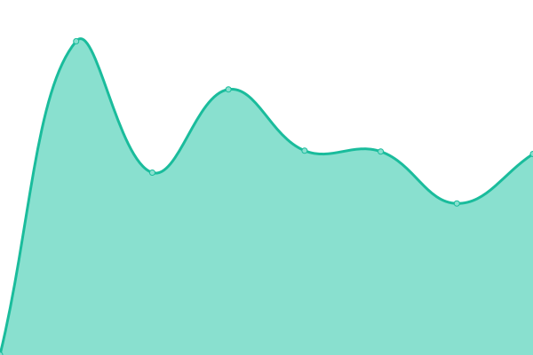
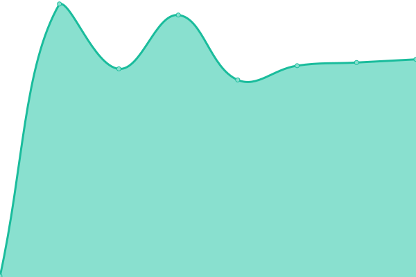

# [📈 Live Status](https://carlostkd.ch): <!--live status--> **🟩 All systems operational**

<!--start: status pages-->
<!-- This summary is generated by Upptime (https://github.com/upptime/upptime) -->
<!-- Do not edit this manually, your changes will be overwritten -->
<!-- prettier-ignore -->
| URL | Status | History | Response Time | Uptime |
| --- | ------ | ------- | ------------- | ------ |
|  carlostkd | 🟩 Up | [carlostkd.yml](https://github.com/carlostkd/status/commits/HEAD/history/carlostkd.yml) | 

 822ms
     
 | 

<a href="https://carlostkd.github.io/status/history/carlostkd">100.00%</a>
    

|  Recognizing People | 🟩 Up | [recognizing-people.yml](https://github.com/carlostkd/status/commits/HEAD/history/recognizing-people.yml) | 

 540ms
     
 | 

<a href="https://carlostkd.github.io/status/history/recognizing-people">100.00%</a>
    

|  sophie | 🟩 Up | [sophie.yml](https://github.com/carlostkd/status/commits/HEAD/history/sophie.yml) | 

 264ms
     
 | 

<a href="https://carlostkd.github.io/status/history/sophie">100.00%</a>
    

|  Keys | 🟩 Up | [keys.yml](https://github.com/carlostkd/status/commits/HEAD/history/keys.yml) | 

 208ms
     
 | 

<a href="https://carlostkd.github.io/status/history/keys">100.00%</a>
    

|  STORAGE | 🟩 Up | [storage.yml](https://github.com/carlostkd/status/commits/HEAD/history/storage.yml) | 

 135ms
     
 | 

<a href="https://carlostkd.github.io/status/history/storage">100.00%</a>
    

|  Mobile | 🟩 Up | [mobile.yml](https://github.com/carlostkd/status/commits/HEAD/history/mobile.yml) | 

 383ms
     
 | 

<a href="https://carlostkd.github.io/status/history/mobile">100.00%</a>
    

|  Teams | 🟩 Up | [teams.yml](https://github.com/carlostkd/status/commits/HEAD/history/teams.yml) | 

 292ms
     
 | 

<a href="https://carlostkd.github.io/status/history/teams">100.00%</a>
    

|  DNS | 🟩 Up | [dns.yml](https://github.com/carlostkd/status/commits/HEAD/history/dns.yml) | 

 0ms
     
 | 

<a href="https://carlostkd.github.io/status/history/dns">100.00%</a>
    

<!--end: status pages-->

[**Visit our status website →**](https://carlostkd.github.io/status)

## 📄 License

- Code: [MIT](./LICENSE) © [Carlostkd](https://carlostkd.ch)
