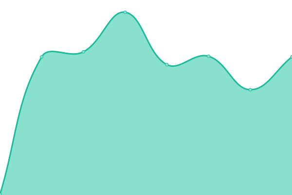

# [📈 Live Status](https://carlostkd.ch): <!--live status--> **🟩 All systems operational**

This repository contains the open-source uptime monitor and status page for [Carlostkd](https://carlostkd.ch), powered by [Upptime](https://github.com/upptime/upptime).

With [Upptime](https://upptime.js.org), you can get your own unlimited and free uptime monitor and status page, powered entirely by a GitHub repository. We use [Issues](https://github.com/carlostkd/status/issues) as incident reports, [Actions](https://github.com/carlostkd/status/actions) as uptime monitors, and [Pages](https://carlostkd.ch) for the status page.

<!--start: status pages-->
<!-- This summary is generated by Upptime (https://github.com/upptime/upptime) -->
<!-- Do not edit this manually, your changes will be overwritten -->
<!-- prettier-ignore -->
| URL | Status | History | Response Time | Uptime |
| --- | ------ | ------- | ------------- | ------ |
|  [carlostkd](https://carlostkd.ch) | 🟩 Up | [carlostkd.yml](https://github.com/carlostkd/status/commits/HEAD/history/carlostkd.yml) | 

 896ms
     
 | 

<a href="https://carlostkd.ch/history/carlostkd">100.00%</a>
    

|  [sophie](https://carlostkd.ch/sophie) | 🟩 Up | [sophie.yml](https://github.com/carlostkd/status/commits/HEAD/history/sophie.yml) | 

 290ms
     
 | 

<a href="https://carlostkd.ch/history/sophie">100.00%</a>
    

|  [Keys](https://carlostkd.ch/cloud/search.php) | 🟩 Up | [keys.yml](https://github.com/carlostkd/status/commits/HEAD/history/keys.yml) | 

 247ms
     
 | 

<a href="https://carlostkd.ch/history/keys">100.00%</a>
    

|  [AI](https://carlostkd.ch/AI) | 🟩 Up | [ai.yml](https://github.com/carlostkd/status/commits/HEAD/history/ai.yml) | 

 290ms
     
 | 

<a href="https://carlostkd.ch/history/ai">100.00%</a>
    

<!--end: status pages-->

[**Visit our status website →**](https://carlostkd.ch)

## 📄 License

- Powered by: [Upptime](https://github.com/upptime/upptime)
- Code: [MIT](./LICENSE) © [Carlostkd](https://carlostkd.ch)
- Data in the `./history` directory: [Open Database License](https://opendatacommons.org/licenses/odbl/1-0/)
